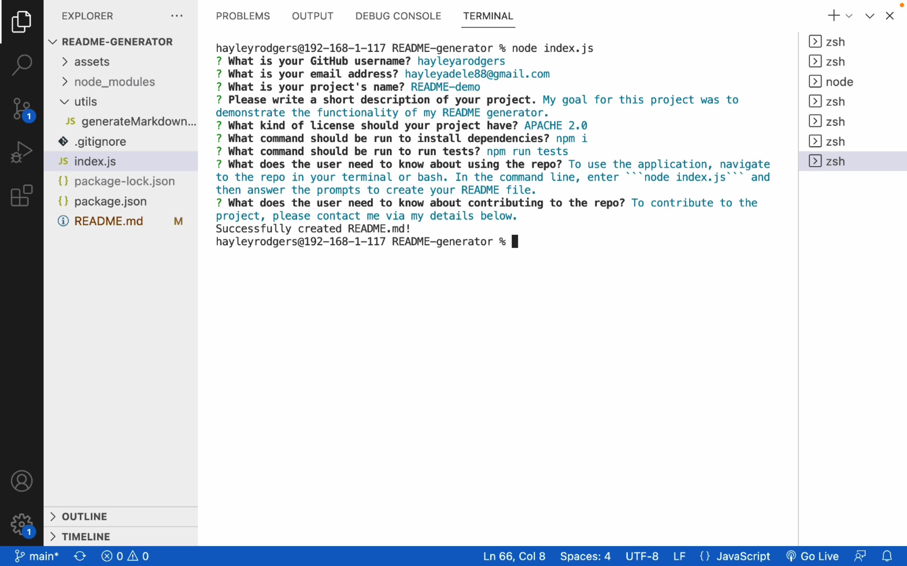
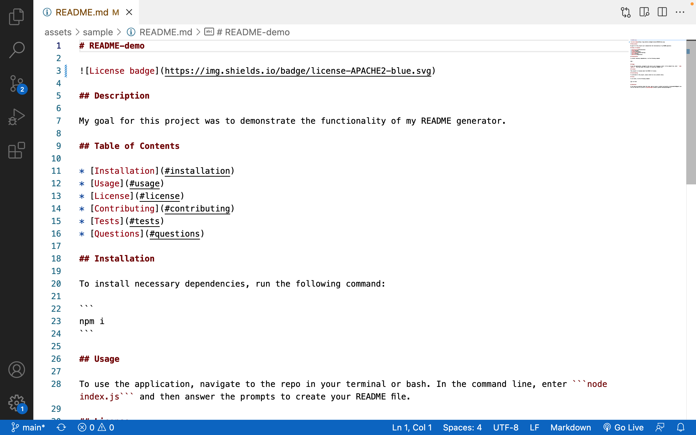

# README-generator

## Description

My goal for this project was to create a command-line application that dynamically generates a professional README.md file, based on a user's inputs. By allowing the user to quickly and easily generate a README.md file, this application gives the user more time to devote to other parts of their project.

To achieve this, I used Javascript. In particular, I used the [Inquirer](https://www.npmjs.com/package/inquirer/v/8.2.4) package.





During this project, I consolidated my understanding of Javascript. In particular, I re-inforced what I have learnt about:
- Node.js
- npm
- And, Inquirer.

## Access

To access the repository where the code is saved, click [here](https://github.com/hayleyarodgers/README-generator).

To access a video walkthrough tutorial of the application, click [here](./assets/walkthrough/README-generator-demo-HRodgers.mp4) to access it directly or [here](https://drive.google.com/file/d/1Tucp2bN3NHOKrtwlf0NPENYaCYpe01QY/view?usp=sharing) to access it via GoogleDrive.

To view a sample of a README.md file generated by the application, click [here](./assets/sample/README.md).

## Usage

To use the application:
1. Open the repository in your terminal or bash.
2. In the command-line, enter ```node index.js```
3. In the command-line, answer the prompts. 

## Credits

- I used this [starter code](https://github.com/coding-boot-camp/potential-enigma) as a framework for the code I wrote.
- I used the [Inquirer](https://www.npmjs.com/package/inquirer/v/8.2.4) package to show prompts and collect responses from the user.
- I used this [guide](https://coding-boot-camp.github.io/full-stack/github/professional-readme-guide) on how to create a professional README file.
- I used this [guide](https://coding-boot-camp.github.io/full-stack/computer-literacy/video-submission-guide) on how to make a video walkthrough tutorial.